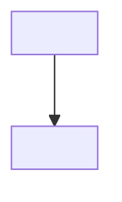

<!-- Template: the entry point. The MAP of the space. Replace every <placeholder>.
     Keep refs portable ($HOME, ~, repo-relative) — validate.sh fails on /Users/... -->
# <Space name> — documentation

Self-contained docs for <what this is>. No private or machine-specific detail.

- **[ARCHITECTURE.md](ARCHITECTURE.md)** — the system, boundaries, decisions.
- **[ROADMAP.md](ROADMAP.md)** — milestones + building blocks.
- **[MEMORY.md](MEMORY.md)** — footprint per component.

## The parts
| Part | What it is | Repo |
|---|---|---|
| <part> | <role> | <repo> |

## How they relate

> Rendered export (PNG): [assets/<name>.png](assets/<name>.png)
