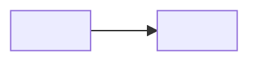

<!-- Template: the system. Components + trust/egress boundary + ADRs + open questions.
     Every claim grounded in a real path/command. Diagrams as Mermaid + PNG export. -->
# Architecture — <Space name>

## System overview

## Components
| Component | Where | Role | Trust |
|---|---|---|---|
| <name> | <path> | <role> | <level> |

## Trust boundary & egress
<what leaves the boundary, to where, under what control>

## Architecture decision records (ADR)
- **ADR-1 — <decision>.** <choice + why + abort-condition>.

## Open questions
| # | Question | Owner |
|---|---|---|
| OQ-1 | <question> | <owner> |
